# Code Firewall MCP

<!-- mcp-name: io.github.egoughnour/code-firewall-mcp -->

[](https://pypi.org/project/code-firewall-mcp/)
[](https://github.com/egoughnour/code-firewall-mcp/releases/latest/download/code-firewall-mcp.mcpb)
[](https://github.com/egoughnour/code-firewall-mcp/actions/workflows/test.yml)
[](https://github.com/egoughnour/code-firewall-mcp/actions/workflows/release.yml)
[](https://www.python.org/)
[](https://opensource.org/licenses/MIT)

[](https://github.com/egoughnour/code-firewall-mcp/languages) [](https://github.com/egoughnour/code-firewall-mcp) [](https://github.com/egoughnour/code-firewall-mcp/commits/main) [](https://github.com/egoughnour/code-firewall-mcp)


A structural similarity-based code security filter for MCP (Model Context Protocol). Blocks dangerous code patterns before they reach execution tools by comparing code structure against a blacklist of known-bad patterns.

## How It Works

```mermaid
flowchart LR
    A[Code<br/>file/string] --> B[Parse & Normalize<br/>tree-sitter]
    B --> C[Embed<br/>Ollama]
    C --> D{Similarity Check<br/>vs Blacklist}
    D -->|≥ threshold| E[🚫 BLOCKED]
    D -->|< threshold| F[✅ ALLOWED]
    F --> G[Execution Tools<br/>rlm_exec, etc.]

    style E fill:#ff6b6b,color:#fff
    style F fill:#51cf66,color:#fff
    style D fill:#339af0,color:#fff
```



1. **Parse** code to Concrete Syntax Tree (CST) using tree-sitter
2. **Normalize** by stripping identifiers and literals → structural skeleton
3. **Embed** the normalized structure via Ollama
4. **Compare** against blacklisted patterns in ChromaDB
5. **Block** if similarity exceeds threshold, otherwise **allow**

## Key Insight

Code patterns like `os.system("rm -rf /")` and `os.system("ls")` have **identical structure**. By normalizing away the specific commands/identifiers, we can detect dangerous patterns regardless of the specific arguments used.

**Security-sensitive identifiers are preserved** during normalization (e.g., `eval`, `exec`, `os`, `system`, `subprocess`, `Popen`, `shell`) to ensure embeddings remain discriminative for dangerous patterns.

## Installation

### Quick Start

**Option 1: PyPI (Recommended)**

```bash
uvx code-firewall-mcp
# or
pip install code-firewall-mcp
```

**Option 2: Claude Desktop One-Click**

Download the `.mcpb` from [Releases](https://github.com/egoughnour/code-firewall-mcp/releases) and double-click to install.

**Option 3: From Source**

```bash
git clone https://github.com/egoughnour/code-firewall-mcp.git
cd code-firewall-mcp
uv sync
```

### Wire to Claude Code / Claude Desktop

Add to `~/.claude/.mcp.json` (Claude Code) or `claude_desktop_config.json` (Claude Desktop):

```json
{
  "mcpServers": {
    "code-firewall": {
      "command": "uvx",
      "args": ["code-firewall-mcp"],
      "env": {
        "FIREWALL_DATA_DIR": "~/.code-firewall",
        "OLLAMA_URL": "http://localhost:11434"
      }
    }
  }
}
```

## Requirements

- Python 3.10+ (< 3.14 due to onnxruntime compatibility)
- Ollama (for embeddings)
- ChromaDB (for vector storage)
- tree-sitter (optional, for better parsing)

## Setting Up Ollama (Embeddings)

Code Firewall can automatically install and configure Ollama on macOS with Apple Silicon. There are **two installation methods**:

### Method 1: Homebrew Installation

```python
# 1. Check system requirements
firewall_system_check()

# 2. Install via Homebrew
firewall_setup_ollama(install=True, start_service=True, pull_model=True)
```

**What this does:**
- Installs Ollama via Homebrew (`brew install ollama`)
- Starts Ollama as a managed background service
- Pulls nomic-embed-text model for embeddings

### Method 2: Direct Download (No Sudo)

```python
# 1. Check system
firewall_system_check()

# 2. Install via direct download - no sudo, no Homebrew
firewall_setup_ollama_direct(install=True, start_service=True, pull_model=True)
```

**What this does:**
- Downloads Ollama from https://ollama.com
- Extracts to `~/Applications/` (no admin needed)
- Starts Ollama via `ollama serve`
- Pulls nomic-embed-text model

### Manual Setup

```bash
# Install Ollama
brew install ollama
# or download from https://ollama.ai

# Start service
brew services start ollama
# or: ollama serve

# Pull embedding model
ollama pull nomic-embed-text

# Verify
firewall_ollama_status()
```

## Tools

### Setup & Status Tools

| Tool | Purpose |
|------|---------|
| `firewall_system_check` | **Check system requirements** — verify macOS, Apple Silicon, RAM |
| `firewall_setup_ollama` | **Install via Homebrew** — managed service, auto-updates |
| `firewall_setup_ollama_direct` | **Install via direct download** — no sudo, fully headless |
| `firewall_ollama_status` | **Check Ollama availability** — verify embeddings are ready |

### Firewall Tools

| Tool | Purpose |
|------|---------|
| `firewall_check` | Check if a code file is safe to execute |
| `firewall_check_code` | Check code string directly (no file required) |
| `firewall_blacklist` | Add a dangerous pattern to the blacklist |
| `firewall_record_delta` | Record near-miss variants for classifier sharpening |
| `firewall_list_patterns` | List patterns in blacklist or delta collection |
| `firewall_remove_pattern` | Remove a pattern from blacklist or deltas |
| `firewall_status` | Get firewall status and statistics |

### `firewall_check`
Check if a code file is safe to pass to execution tools.

```python
result = await firewall_check(file_path="/path/to/script.py")
# Returns: {allowed: bool, blocked: bool, similarity: float, ...}
```

### `firewall_check_code`
Check code string directly (no file required).

```python
result = await firewall_check_code(
    code="import os; os.system('rm -rf /')",
    language="python"
)
```

### `firewall_blacklist`
Add a dangerous pattern to the blacklist.

```python
result = await firewall_blacklist(
    code="os.system(arbitrary_command)",
    reason="Arbitrary command execution",
    severity="critical"
)
```

### `firewall_record_delta`
Record near-miss variants to sharpen the classifier.

```python
result = await firewall_record_delta(
    code="subprocess.run(['ls', '-la'])",
    similar_to="abc123",
    notes="Legitimate use case for file listing"
)
```

### `firewall_list_patterns`
List patterns in the blacklist or delta collection.

### `firewall_remove_pattern`
Remove a pattern from blacklist or deltas.

### `firewall_status`
Get firewall status and statistics.

## Configuration

Environment variables:

| Variable | Default | Description |
|----------|---------|-------------|
| `FIREWALL_DATA_DIR` | `/tmp/code-firewall` | Data storage directory |
| `OLLAMA_URL` | `http://localhost:11434` | Ollama server URL |
| `EMBEDDING_MODEL` | `nomic-embed-text` | Ollama embedding model |
| `SIMILARITY_THRESHOLD` | `0.85` | Block threshold (0-1) |
| `NEAR_MISS_THRESHOLD` | `0.70` | Near-miss recording threshold |

## Usage Pattern

### Pre-filter for massive-context-mcp

Use code-firewall-mcp as a gatekeeper before passing code to `rlm_exec`:

```python
# 1. Check code safety
check = await firewall_check_code(user_code)

if check["blocked"]:
    print(f"BLOCKED: {check['reason']}")
    return

# 2. If allowed, proceed with execution
result = await rlm_exec(code=user_code, context_name="my-context")
```

### Integrated with massive-context-mcp

Install massive-context-mcp with firewall integration:

```bash
pip install massive-context-mcp[firewall]
```

When enabled, `rlm_exec` automatically checks code against the firewall before execution.

### Building the Blacklist

The blacklist grows through use:

1. **Initial seeding**: Add known dangerous patterns
2. **Audit feedback**: When `rlm_auto_analyze` finds security issues, add patterns
3. **Delta sharpening**: Record near-misses to improve classification boundaries

```python
# After security audit finds issues
await firewall_blacklist(
    code=dangerous_code,
    reason="Command injection via subprocess",
    severity="critical"
)
```

## Structural Normalization


The normalizer strips:
- **Identifiers**: `my_var` → `_` (except security-sensitive ones)
- **String literals**: `"hello"` → `"S"`
- **Numbers**: `42` → `N`
- **Comments**: Removed entirely

**Preserved identifiers** (for better pattern matching):
- `eval`, `exec`, `compile`, `__import__`
- `os`, `system`, `popen`, `subprocess`, `Popen`, `shell`
- `open`, `read`, `write`, `socket`, `connect`
- `getattr`, `setattr`, `__globals__`, `__builtins__`
- And more security-sensitive names...

Example:
```python
# Original
subprocess.run(["curl", url, "-o", output_file])

# Normalized (preserves 'subprocess' and 'run')
subprocess.run(["S", _, "S", _])
```

Both `subprocess.run(["curl", ...])` and `subprocess.run(["wget", ...])` normalize to the same structure, so blacklisting one catches both.

## License

MIT
